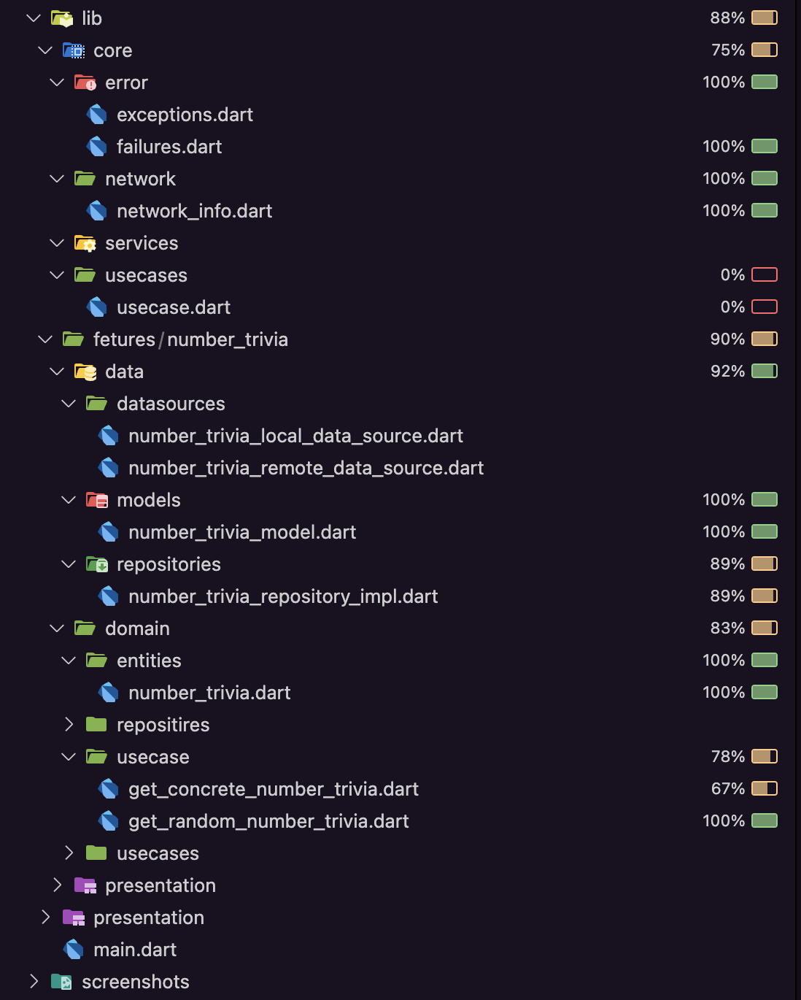

# Clean Architecture TDD

A Flutter project implementing Clean Architecture with Test-Driven Development (TDD) principles.

## Screenshots



*Test coverage report showing comprehensive unit test results*

## Project Overview

This project demonstrates:
- **Clean Architecture** implementation
- **Test-Driven Development (TDD)** approach
- **Unit testing** with comprehensive coverage
- **Repository pattern** with data sources
- **Error handling** with custom exceptions and failures
- **Mock testing** using Mocktail

## Getting Started

This project is a starting point for a Flutter application implementing Clean Architecture.

A few resources to get you started if this is your first Flutter project:

- [Lab: Write your first Flutter app](https://docs.flutter.dev/get-started/codelab)
- [Cookbook: Useful Flutter samples](https://docs.flutter.dev/cookbook)

For help getting started with Flutter development, view the
[online documentation](https://docs.flutter.dev/), which offers tutorials,
samples, guidance on mobile development, and a full API reference.

## Project Structure

```
lib/
├── core/
│   ├── error/
│   ├── network/
│   └── usecases/
├── fetures/
│   └── number_trivia/
│       ├── data/
│       ├── domain/
│       └── presentation/
└── main.dart
```

## Testing

Run the tests with coverage:
```bash
flutter test --coverage
```

Generate HTML coverage report:
```bash
genhtml coverage/lcov.info -o coverage/html
```

## Dependencies

- **dartz**: Functional programming with Either
- **equatable**: Value equality
- **mocktail**: Mocking for tests
- **shared_preferences**: Local storage
- **data_connection_checker_nulls**: Network connectivity